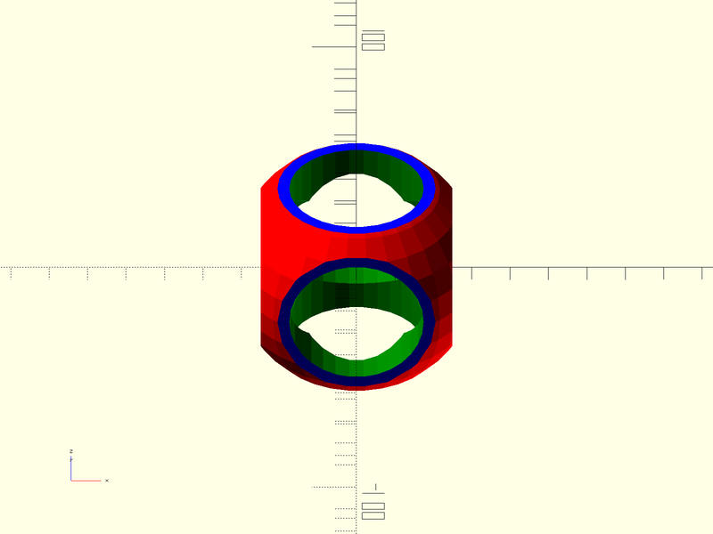

# Getting Your Head Around OpenSCAD

<!-- TOC -->

## Introduction
  OpenSCAD is a script-based CAD program for designing 2D and 3D objects.

  OpenSCAD is based on Constructive Solid Geometry (CSG).
  CSG uses three boolean operators to combine objects: Union, Difference, and Intersection.
  
  * The **union** of two objects contains everything in both objects.
  * The **intersection** of two objects contains only that which is in both objects.
  * The **difference** of two objects contains the result of subtracting the second from the first.

```openscad
$vpr = [55, 360*$t, 360*$t];
$vpd = 350;
   difference() { 
    intersection() {
        color("red") sphere(d = 65);
        color("blue") cube(50, center = true);
    }
    union() {
        color("green") {
            cylinder(h = 55, d = 35, center = true);
            rotate([90,0,0]) cylinder(h = 55, d = 35, center = true);
            rotate([0,90,0])cylinder(h = 55, d = 35, center = true);
        }
    }
}
```

